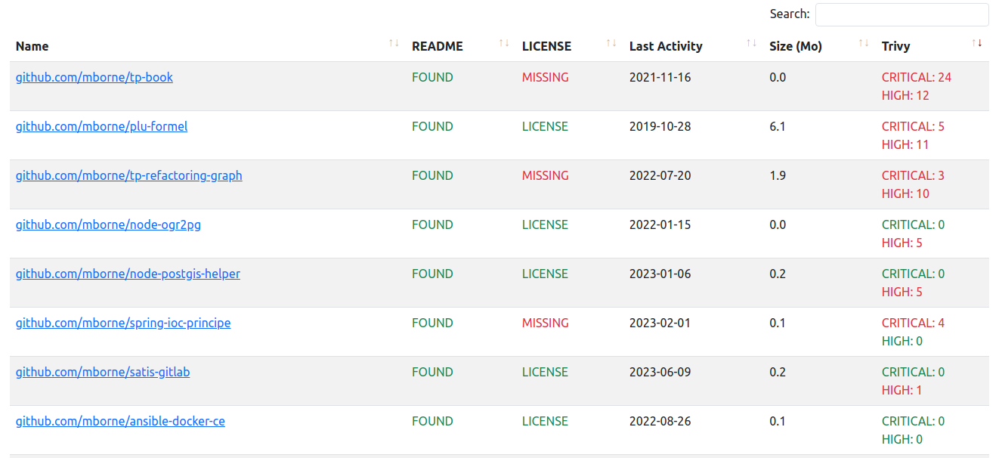

# git-manager

[](https://github.com/mborne/git-manager/actions/workflows/ci.yml)

CLI helpers to backup and review a set of git repositories.

## Features

* Retrieve and backup hosted GIT repositories (github, gitlab, gogs, gitea)
* Compute stats and performs some basic checks (ex : README.md, LICENSE, [trivy scan](https://aquasecurity.github.io/trivy/),...)
* View stats and checks :



## Requirements

* [PHP >= 8.4](https://www.php.net/supported-versions)
* [trivy](https://trivy.dev/docs/latest/getting-started/installation/) (**optional**)
* [gitleaks](https://github.com/gitleaks/gitleaks#readme) (**optional**)

## Parameters

| Name              | Description                           | Default                 |
| ----------------- | ------------------------------------- | ----------------------- |
| `GIT_MANAGER_DIR` | Directory containing git repositories | `{projectDir}/var/data` |
| `TRIVY_ENABLED`   | Enable/disable trivy scan             | `true`                  |
| `GITLEAKS_ENABLED`   | Enable/disable gitleaks scan       | `true`                  |

## Setup

```bash
git clone https://github.com/mborne/git-manager
cd git-manager
composer install
```

## Usage

### Fetch repositories

* From github :

```bash
bin/console git:fetch --orgs IGNF --users=mborne https://github.com $GITHUB_TOKEN
# for private repositories, use "_me_" :
bin/console git:fetch --users=_me_ https://github.com $GITHUB_TOKEN
```

* From gogs or gitea :

```bash
bin/console git:fetch --type gogs-v1 https://codes.quadtreeworld.net $QTW_TOKEN
```

* From gitlab :

```bash
bin/console git:fetch https://gitlab.com -u mborne $GITLAB_TOKEN
```

## Usage with docker

```bash
# Build image
docker compose build
# Start git-manager on http://localhost:8000
docker compose up -d

# Fetch repositories
docker compose exec git-manager bin/console git:fetch https://github.com -u mborne
#docker compose exec git-manager bin/console git:fetch --type gogs-v1 https://codes.quadtreeworld.net $QTW_TOKEN
```

## License

[MIT](LICENSE)

